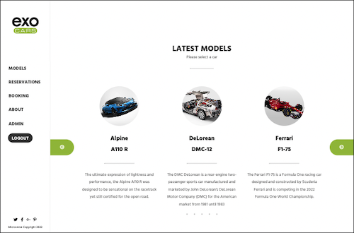

# FINAL CAPSTONE (FRONT END)

In this project, we created a website for renting exotic cars (exo-cars). It fetches data from an API we also created and deployed on Heroku. It allows users to register with token validation, see the available cars and make reservations. Admins are allowed to add and remove cars from the database.

## Back-end REPO
[Final_capstone_backend](https://github.com/ElsonOtake/Final_capstone_backend)

## Built With

- REACT JS.
- REACT ROUTER.
- REDUX TOOLKIT.
- JEST

### Live demo

[EXO-CARS](https://final-capstone-frontend-fkvzig4w0-elsonotake.vercel.app/login)

### Install

To view this document on your local computer:

- Clone this repository.
- Install dependencies (npm install).
- Run Webpack Bundle (npm run start).

### Linters

- Eslint
- Stylelint
- node_modules checker

### Run tests

`- npm run test`

## Authors

👤 **Gonzalo A. Medina**

- GitHub: [@mgmediaweb](https://github.com/mgmediaweb)
- Twitter: [@GonzoMedinaDev](https://twitter.com/GonzoMedinaDev)
- LinkedIn: [gonzalo-medina-g](https://www.linkedin.com/in/gonzalo-medina-g/)

👤 **Giuseppe Tomasini**

- GitHub: [@GiuseppeTG](https://github.com/GiuseppeTG)
- Twitter: [@giusetomasini](https://twitter.com/giusetomasini)
- LinkedIn: [Giuseppe Tomasini](https://www.linkedin.com/in/giuseppe-tomasini-g/)

👤 **Elson Otake**

- GitHub: [elsonotake](https://github.com/elsonotake)
- Twitter: [@elsonotake](https://twitter.com/elsonotake)
- LinkedIn: [elsonotake](https://linkedin.com/in/elsonotake)

👤 **Marco Antonio Hincapié Montes**

- GitHub: [@AntonioHincapie](https://github.com/AntonioHincapie)
- Twitter: [@MarcoHincapie](https://twitter.com/MarcoHincapie)
- LinkedIn: [LinkedIn](https://www.linkedin.com/in/antoniohincapie/)

## 🤝 Contributing

Contributions, issues, and feature requests are welcome!

Feel free to check the [issues page](../../issues/).

## Show your support

Give a ⭐️ if you like this project!

## Acknowledgments

This site is based on the design created by [Murat Korkmaz](https://www.behance.net/muratk), this design is under the free license [Creative Commons license of the design](https://creativecommons.org/licenses/by-nc/4.0/).

## 📝 License

This project is [MIT](./MIT.md) licensed.
